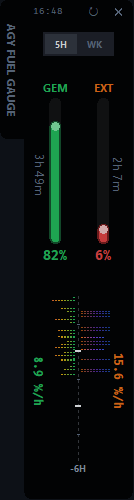
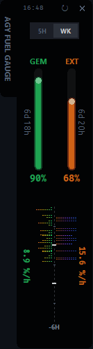

# AGY Fuel Gauge 🚀

**Simplicity is the ultimate sophistication.** While most telemetry tools bombard you with complex dashboards, bloated graphs, and endless configuration files, AGY Fuel Gauge does exactly one thing perfectly: it keeps your AI quotas visible without pulling you out of your flow state.

A minimalist, zero-config widget that just works.

The trick is surprisingly simple: Antigravity already runs a local background daemon (`language_server.exe`) that handles all your token traffic. We eavesdrop on it. This widget hooks directly into that internal gRPC-Web API, giving you an accurate, real-time view of your Gemini and External model usage—no credentials required, no bloated UI, no config files to maintain.

<p align="center">
  
  &nbsp;&nbsp;&nbsp;&nbsp;
  
</p>

## ✨ How it actually works

- **Zero Auth API Hook**: Dynamically scans for the active `language_server.exe` process to extract its listening port and `x-codeium-csrf-token` from startup logs, hooking directly into the internal gRPC-Web API.
- **GDI Frameless UI**: Uses native Windows GDI region APIs (`SetWindowRgn`) to render an irregular L-shaped, frameless window with an absolute black background.
- **Pixel-Perfect Rendering**: The history chart maps each 3-minute data row exactly to a 1-pixel height, rendering a zero-gap equalizer.
- **Dynamic RGB Interpolation**: Implements a 3-keyframe gradient system (GEM: Green → Yellow → Red, EXT: Orange → Purple → Blue) based on usage intensity. Uses a `deepen_rgb` multiplier for values exceeding the physical scale (5.0%).
- **Async Telemetry Sync**: A background thread polls the API without blocking the UI, indicated by a subtle 800ms scanline animation.

## 💻 Compatibility
- **Antigravity 2.0 (Desktop App)**: 100% supported — run it as a Sidecar.
- **Antigravity IDE**: 100% supported.
- **Antigravity CLI (`agy`)**: Not supported. The CLI doesn't maintain the background server this widget taps into.

## 🛠️ Get Started

1. **Clone the repo**
   ```bash
   git clone https://github.com/YuJunWang/AGY_Fuel_Gauge.git
   cd AGY_Fuel_Gauge
   ```

2. **Install dependencies**
   Make sure Python is installed, then:
   ```bash
   pip install pystray Pillow
   ```

3. **Set it up as a background daemon (Recommended)**
   The cleanest way to run this is via Antigravity's Sidecar mechanism, which handles auto-start and crash recovery automatically.

   1. Open your Antigravity config directory (usually `C:\Users\<YourUsername>\.gemini\config\sidecars\`).
   2. Create a new folder named `agy-fuel-gauge`.
   3. Inside it, create a `sidecar.json` with the following content (update the `args` path to your clone location):
      ```json
      {
        "description": "AGY Fuel Gauge",
        "command": "pythonw",
        "args": [
          "E:\\Path\\To\\AGY_Fuel_Gauge\\widget.py"
        ],
        "restart_policy": "always"
      }
      ```

Restart your Antigravity IDE. A circular AGY fuel gauge icon should appear in your Windows system tray. (The `✕` button hides it to the tray and keeps logging in the background; right-click the icon to bring it back.)

---

# AGY Fuel Gauge（中文說明）🚀

**把「極簡」發揮到極致。** 當現今大多數的監控工具都在向你轟炸複雜的數據看板、臃腫的圖表與無止盡的設定檔時，AGY Fuel Gauge 只專注於把一件事情做到完美：讓你能隨時瞥見 AI 剩餘額度，卻絕不打斷你的心流。

這是一款主打零設定、沒有多餘視覺負擔的極簡小工具。

做法其實很直觀：既然 Antigravity 已經在你的電腦裡跑了一支負責通訊的背景精靈（`language_server.exe`），我們直接在它的內部通道（gRPC-Web）上「旁聽」就好。不需要帳號憑證，不需要臃腫的介面，更不需要維護任何設定檔，安裝好就能在背景安靜地回報即時用量。

## ✨ 它是怎麼運作的？

- **API 自動掛載 (Zero Auth Hook)**：動態掃描 `language_server.exe` 進程以取得監聽 Port，並從日誌萃取 `x-codeium-csrf-token`，直接接入內部 gRPC-Web API。
- **GDI 無邊框渲染 (Frameless UI)**：底層呼叫 Windows 原生 GDI Region API (`SetWindowRgn`)，實現不規則 L 型、無邊框且純黑背景的幾何視窗。
- **像素級等化器 (Pixel-Perfect Chart)**：歷史圖表將每 3 分鐘的數據精準映射至 1 像素高度，無縫渲染零間距的等化器視覺。
- **動態 RGB 插值 (Dynamic Interpolation)**：內建三節點漸層引擎（GEM：綠 → 黃 → 紅；EXT：橘 → 紫 → 藍）。當消耗量突破物理刻度（5.0%）時，會觸發 `deepen_rgb` 降亮度、提純度的過載演算法。
- **非同步資料同步 (Async Telemetry)**：使用背景執行緒抓取數據確保 UI 不阻塞，同步時會在資料面板觸發 800ms 的平滑掃描線動畫。

## 💻 支援環境
- **Antigravity 2.0（桌面版）**：100% 支援，建議搭配 Sidecar 機制使用。
- **Antigravity IDE**：100% 支援。
- **Antigravity CLI（`agy`）**：不支援。指令列環境沒有這支工具需要旁聽的背景服務。

## 🛠️ 安裝方式

1. **把專案 Clone 下來**
   ```bash
   git clone https://github.com/YuJunWang/AGY_Fuel_Gauge.git
   cd AGY_Fuel_Gauge
   ```

2. **裝好必備套件**
   確認 Python 已安裝，接著執行：
   ```bash
   pip install pystray Pillow
   ```

3. **掛載成背景守護進程（建議）**
   透過 Antigravity 的 Sidecar 機制來管理，可以自動啟動與崩潰復原，省去手動執行的麻煩。

   1. 打開 Antigravity 設定檔目錄（通常在 `C:\Users\<你的帳號>\.gemini\config\sidecars\`）。
   2. 在裡面建立一個叫做 `agy-fuel-gauge` 的新資料夾。
   3. 在資料夾內新增 `sidecar.json`，內容如下（記得把路徑換成你實際 clone 的位置）：
      ```json
      {
        "description": "AGY Fuel Gauge",
        "command": "pythonw",
        "args": [
          "E:\\你的\\路徑\\AGY_Fuel_Gauge\\widget.py"
        ],
        "restart_policy": "always"
      }
      ```

重新啟動 Antigravity IDE 後，右下角的 Windows 系統匣應該就會出現圓形的 AGY 儀表板小圖示。按右上角的 `✕` 只是把它收進系統匣繼續背景記錄，對著圖示點右鍵就可以再次喚醒它。