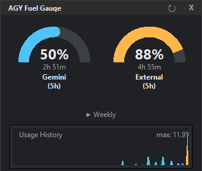

# AGY Fuel Gauge 🚀

AGY Fuel Gauge is a sleek, background-running telemetry widget designed exclusively for Antigravity. It monitors your language model quotas (Gemini and External models like Claude/GPT) in real-time, completely bypassing the need for manual browser interactions by utilizing Chrome DevTools Protocol (CDP) to seamlessly hook into your active Antigravity session.



## ✨ Features
- **Real-Time Telemetry**: Accurately fetches your 5-hour and weekly remaining quotas directly from the Antigravity gRPC-Web API.
- **Zero-Overhead Authentication**: Automatically sniffs the required `x-codeium-csrf-token` securely from background traffic—no login or manual token copying required!
- **Dynamic Arc Gauges**: Beautifully rendered circular progress arcs indicating remaining percentage and precise reset times.
- **Collapsible Layout**: Quickly toggle between 5-hour and Weekly limits without expanding the widget footprint.
- **Usage History & Burn Rate**: Logs your usage locally every 3 minutes to generate a historical bar chart and calculate your current hourly burn rate (`🔥 %/h`).

## 🛠️ Installation & Usage

1. **Clone the Repository**
   ```bash
   git clone https://github.com/YuJunWang/AGY_Fuel_Gauge.git
   cd AGY_Fuel_Gauge
   ```

2. **Install Dependencies**
   Ensure you have Python 3 installed.
   ```bash
   pip install requests websocket-client pystray Pillow
   ```

3. **Configure as an Antigravity Sidecar (Recommended)**
   To have the widget automatically launch and close with Antigravity:
   - Open your Antigravity configuration folder (typically `C:\Users\<YourUsername>\.gemini\config\sidecars\`).
   - Create a new folder named `agy-fuel-gauge`.
   - Create a file named `sidecar.json` inside that folder with the following content (update the `args` path to match your actual clone directory):
     ```json
     {
       "description": "AGY Fuel Gauge",
       "command": "pythonw",
       "args": [
         "E:\\Path\\To\\AGY_Fuel_Gauge\\widget.py"
       ],
       "restart_policy": "always"
     }
     ```
   - Restart Antigravity. The widget will now appear in your system tray automatically!

4. **Manual Run**
   You can also simply run the widget manually without integrating it into Antigravity:
   ```bash
   pythonw widget.py
   ```

---

# AGY Fuel Gauge (中文說明) 🚀

AGY Fuel Gauge 是一個專為 Antigravity 打造的高質感背景監控儀表板。它能即時追蹤您的 AI 模型額度（包含 Gemini 與 Claude/GPT 等外部模型）。本工具利用 Chrome DevTools Protocol (CDP) 技術直接掛載於 Antigravity，達到「全自動、無感」的安全認證與數據抓取。

## ✨ 核心功能
- **即時遙測**：直接串接 Antigravity 底層的 gRPC-Web API，獲取最精確的 5 小時與週用量剩餘額度。
- **無痛認證**：透過 CDP 在背景自動攔截最新的 `x-codeium-csrf-token`，完全不需要手動登入或複製 Token。
- **動態圓弧儀表**：純手工繪製的高質感圓弧進度條，並能精準推算出下一次的額度重置時間。
- **原地切換視圖**：點擊切換按鈕，即可在 5 小時額度與週額度之間快速切換，不佔用額外螢幕空間。
- **歷史分析與燃燒率**：每 3 分鐘自動於本地端紀錄一次額度變化，並在視窗下方繪製長條圖，即時計算您的每小時額度消耗速度 (`🔥 %/h`)。

## 🛠️ 安裝與使用指南

1. **下載專案**
   ```bash
   git clone https://github.com/YuJunWang/AGY_Fuel_Gauge.git
   cd AGY_Fuel_Gauge
   ```

2. **安裝必備套件**
   請確認您已安裝 Python 3，接著執行以下指令：
   ```bash
   pip install requests websocket-client pystray Pillow
   ```

3. **設定為 Antigravity Sidecar 自動啟動 (推薦做法)**
   為了達到最完美的體驗，建議讓它隨著 Antigravity 自動開啟與關閉：
   - 打開您的 Antigravity 設定資料夾（通常位於 `C:\Users\<您的使用者名稱>\.gemini\config\sidecars\`）。
   - 在裡面建立一個名為 `agy-fuel-gauge` 的新資料夾。
   - 在該資料夾內建立一個 `sidecar.json` 檔案，內容如下（請記得將 `args` 裡的路徑替換成您實際下載專案的路徑，並使用雙斜線 `\\`）：
     ```json
     {
       "description": "AGY Fuel Gauge",
       "command": "pythonw",
       "args": [
         "E:\\您的\\路徑\\AGY_Fuel_Gauge\\widget.py"
       ],
       "restart_policy": "always"
     }
     ```
   - 重新啟動 Antigravity。您會在 Windows 右下角的系統列看見熟悉的 AGY 圖示！

4. **手動啟動**
   如果您不想設定 Sidecar，也可以直接手動點擊或執行指令來啟動：
   ```bash
   pythonw widget.py
   ```
