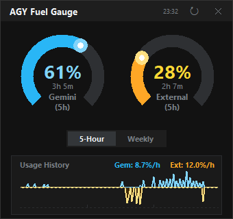
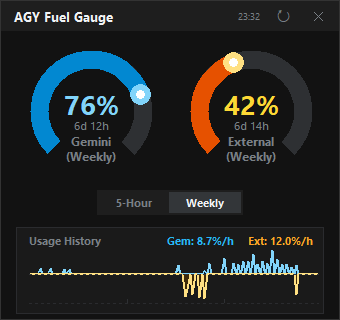

# AGY Fuel Gauge 🚀

AGY Fuel Gauge is a sleek, background-running telemetry widget designed exclusively for Antigravity. It monitors your language model quotas (Gemini and External models like Claude/GPT) in real-time, completely bypassing the need for manual browser interactions by utilizing Chrome DevTools Protocol (CDP) to seamlessly hook into your active Antigravity session.

<p align="center">
  
  &nbsp;&nbsp;
  
</p>

## ✨ Features
- **Real-Time Telemetry**: Accurately fetches your 5-hour and weekly remaining quotas directly from the Antigravity gRPC-Web API.
- **Zero-Overhead Authentication**: Automatically sniffs the required `x-codeium-csrf-token` securely from background traffic—no login or manual token copying required!
- **Dynamic Arc Gauges**: Beautifully rendered circular progress arcs indicating remaining percentage and precise reset times.
- **Collapsible Layout**: Quickly toggle between 5-hour and Weekly limits without expanding the widget footprint.
- **Usage History & Burn Rate**: Logs your usage locally every 3 minutes to generate a historical bar chart and calculate your current hourly burn rate (`🔥 %/h`).

> [!NOTE]
> **Understanding Usage Percentages**  
> Gemini and non-Gemini (External) models have vastly different total quota pools. A 1% drop in Gemini quota represents significantly more tokens processed than a 1% drop in External quota. Therefore, you cannot simply compare their raw percentages. The historical usage graph utilizes a **Self-Normalized Mirrored Area Chart** to balance this visual discrepancy, allowing you to clearly see the usage trends of both models without one crushing the other.

## 💻 Compatibility
- **Antigravity 2.0 (Desktop App)**: Fully supported (Includes CDP telemetry & Sidecar lifecycle automation).
- **Antigravity IDE**: Fully supported.
- **Antigravity CLI (`agy`)**: Not directly applicable, as the CLI does not spawn the persistent background Chrome devtools endpoint required for telemetry interception.

## 🛠️ Installation & Usage

1. **Clone the Repository**
   ```bash
   git clone https://github.com/YuJunWang/AGY_Fuel_Gauge.git
   cd AGY_Fuel_Gauge
   ```

2. **Install Dependencies**
   Ensure you have Python 3 installed.
   ```bash
   pip install requests websocket-client pystray Pillow
   ```

3. **Automate with Antigravity Sidecar (Highly Recommended)**
   This widget is designed to run seamlessly in the background as an [Antigravity Sidecar](https://antigravity.google/docs/sidecars). By setting it up this way, the widget becomes an "immortal" background process that starts automatically when you open your workspace, stays out of your way, and automatically revives if it crashes.
   
   - Open your Antigravity configuration folder (typically `C:\Users\<YourUsername>\.gemini\config\sidecars\`).
   - Create a new folder named `agy-fuel-gauge`.
   - Create a file named `sidecar.json` inside that folder with the following content (update the `args` path to match your actual clone directory):
     ```json
     {
       "description": "AGY Fuel Gauge",
       "command": "pythonw",
       "args": [
         "E:\\Path\\To\\AGY_Fuel_Gauge\\widget.py"
       ],
       "restart_policy": "always"
     }
     ```
   - **How to use it**: Restart your Antigravity IDE. You don't need to run any commands; the system will automatically launch the widget silently. You will see a blue `AGY` icon in your Windows system tray (bottom right).
   - **Hide/Show**: Click the `✕` on the widget to hide it (it continues logging in the background). Right-click the system tray icon and select "Show Widget" to bring it back.

4. **Manual Run**
   You can also simply run the widget manually without integrating it into Antigravity:
   ```bash
   pythonw widget.py
   ```

---

# AGY Fuel Gauge (中文說明) 🚀

AGY Fuel Gauge 是一個專為 Antigravity 打造的高質感背景監控儀表板。它能即時追蹤您的 AI 模型額度（包含 Gemini 與 Claude/GPT 等外部模型）。本工具利用 Chrome DevTools Protocol (CDP) 技術直接掛載於 Antigravity，達到「全自動、無感」的安全認證與數據抓取。

## ✨ 核心功能
- **即時遙測**：直接串接 Antigravity 底層的 gRPC-Web API，獲取最精確的 5 小時與週用量剩餘額度。
- **無痛認證**：透過 CDP 在背景自動攔截最新的 `x-codeium-csrf-token`，完全不需要手動登入或複製 Token。
- **動態圓弧儀表**：純手工繪製的高質感圓弧進度條，並能精準推算出下一次的額度重置時間。
- **原地切換視圖**：點擊切換按鈕，即可在 5 小時額度與週額度之間快速切換，不佔用額外螢幕空間。
- **歷史分析與燃燒率**：每 3 分鐘自動於本地端紀錄一次額度變化，並在視窗下方繪製長條圖，即時計算您的每小時額度消耗速度 (`🔥 %/h`)。

> [!NOTE]
> **關於配額百分比的視覺化說明**  
> Gemini 與非 Gemini (External) 模型的總可用額度基數相差非常大。Gemini 的 1% 消耗量，實際上代表的處理量遠大於 External 的 1%。因此，兩者的消耗百分比不能單純拿來直接類比。為了完美呈現這個落差，歷史圖表特別採用了 **自我正規化的倒影圖 (Mirrored Area Chart)**：藍色與黃色會各自根據自己的最大值進行縮放，讓兩者的使用趨勢變化能清晰地並排呈現，而不會因為基數差異導致一方在視覺上被徹底壓縮。

## 💻 系統相容性
- **Antigravity 2.0 (桌面版應用程式)**：完全支援（包含 CDP 遙測抓取與 Sidecar 自動化生命週期）。
- **Antigravity IDE**：完全支援。
- **Antigravity CLI (`agy`)**：不適用。因純命令列環境不會常駐開啟可用於攔截通訊的 CDP 端點。

## 🛠️ 安裝與使用指南

1. **下載專案**
   ```bash
   git clone https://github.com/YuJunWang/AGY_Fuel_Gauge.git
   cd AGY_Fuel_Gauge
   ```

2. **安裝必備套件**
   請確認您已安裝 Python 3，接著執行以下指令：
   ```bash
   pip install requests websocket-client pystray Pillow
   ```

3. **設定為 Antigravity Sidecar 自動啟動 (強烈推薦)**
   本工具最理想的運作方式，是作為 Antigravity 的 [Sidecar (邊車)](https://antigravity.google/docs/sidecars) 在背景默默運行。設定完成後，它就會變成一個具備「不死鳥」屬性的輔助服務：只要你打開專案它就會自動啟動，就算遇到崩潰也會被系統瞬間自動重啟，達到真正的全自動化。
   
   - **設定方式**：打開您的 Antigravity 設定資料夾（通常位於 `C:\Users\<您的使用者名稱>\.gemini\config\sidecars\`），建立一個名為 `agy-fuel-gauge` 的新資料夾，並在裡面建立一個 `sidecar.json` 檔案（請記得將 `args` 替換成您實際專案的路徑）：
     ```json
     {
       "description": "AGY Fuel Gauge",
       "command": "pythonw",
       "args": [
         "E:\\您的\\路徑\\AGY_Fuel_Gauge\\widget.py"
       ],
       "restart_policy": "always"
     }
     ```
   - **如何啟動與使用**：重新啟動您的 Antigravity IDE 即可！您**完全不需要手動點擊或輸入任何指令**。系統會在背景使用 `pythonw` 靜默啟動程式，此時您會在 Windows 右下角的系統列看見藍色的 AGY 圖示。
   - **隱藏與喚醒**：點擊小工具右上角的 `✕` 只會「隱藏」視窗，程式依然會在背景偷偷記錄你的用量。需要看數據時，只要在右下角系統匣圖示點擊右鍵選擇 `Show Widget`，它就會瞬間彈出。

4. **手動啟動**
   如果您不想設定 Sidecar，也可以直接手動點擊或執行指令來啟動：
   ```bash
   pythonw widget.py
   ```
